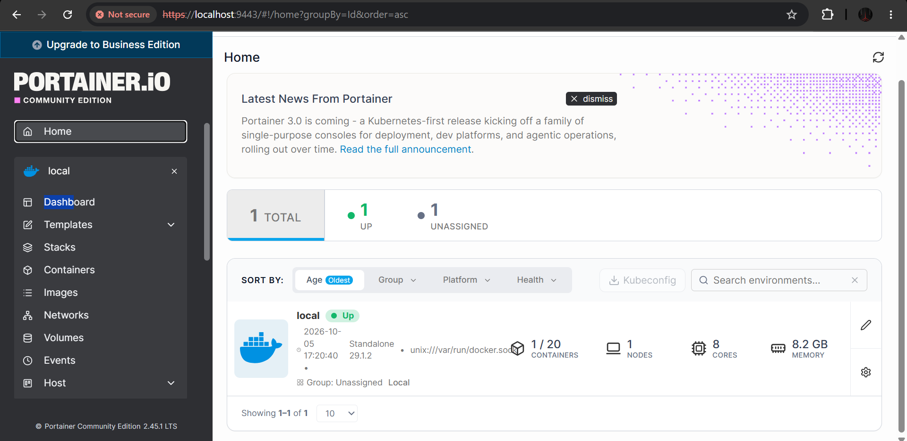

# Task 3: Infrastructure as Code (IaC) with Terraform

## Objective
Provision a local Docker container using Terraform. I used the **Portainer CE** image (`portainer/portainer-ce`), a web UI for managing Docker.

## Tools
- Terraform
- Docker Desktop
- Terraform provider: `kreuzwerker/docker`

## What I Did
1. Wrote `main.tf` with the Docker provider and three resources:
   - `docker_image.portainer` pulls `portainer/portainer-ce:latest`
   - `docker_volume.portainer_data` stores Portainer's persistent data
   - `docker_container.portainer` runs the container (ports 9000 and 9443, Docker socket mount, data volume)
2. Ran `terraform init` to download the Docker provider.
3. Ran `terraform validate` to check syntax and references.
4. Ran `terraform plan` to preview the changes (3 resources to add).
5. Ran `terraform apply` to create the infrastructure.
6. Verified with `docker ps` and opened Portainer at `https://localhost:9443`.
7. Retrieved the one-time setup token from `docker logs terraform-portainer` and created the admin user.
8. Checked state with `terraform state list` and `terraform state show docker_container.portainer`.
9. Ran `terraform destroy` to remove everything, then confirmed with `docker ps -a`.

## Project Structure
```
terraform-docker-task/
├── main.tf              # Terraform configuration
├── .gitignore           # Excludes state files and .terraform/
├── 01-init.log          # terraform init output
├── 02-plan.log          # terraform plan output
├── 03-apply.log         # terraform apply output
├── 04-state.log         # terraform state list output
├── 05-destroy.log       # terraform destroy output
├── screenshots/         # Browser and terminal proof
└── README.md
```

## How to Run
```bash
terraform init
terraform plan
terraform apply
terraform state list
terraform destroy
```

Access Portainer at `http://localhost:9000` or `https://localhost:9443`.
Newer Portainer versions need a one-time setup token, found with `docker logs terraform-portainer`. Create the admin user within 5 minutes of the container starting; if it times out, run `docker restart terraform-portainer`.

## Challenges and Fixes
- **Error: Reference to undeclared resource.** The container referred to `docker_image.portainer`, but the image block was still named `nginx` from an earlier attempt. Renaming the resource label to `portainer` fixed it.
- **Setup token.** Portainer generates a one-time token at startup and prints it in the container logs. I read it with `docker logs`.

Screenshot of Portainer
### Portainer dashboard
